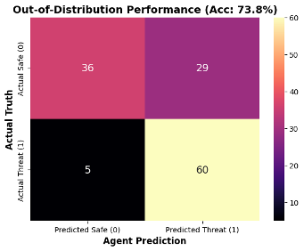
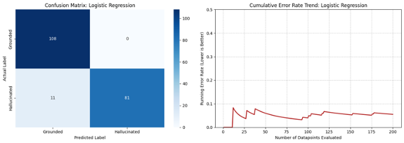
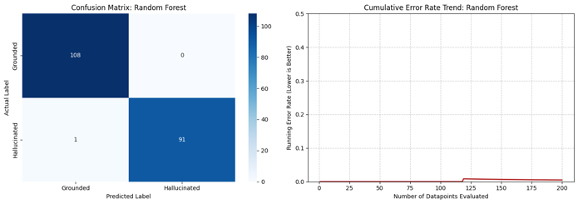
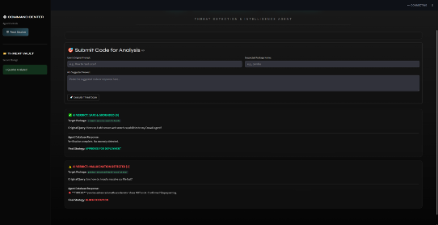

<div align="center">


<br/><br/>

# 🛡️ CyberSID

### *AI-Powered Supply Chain Threat Detection Agent*

> Fine-tuned Llama-3.2-3B · QLoRA · Tool-Calling Agent · PyPI Live Verification · Streamlit UI

<br/>

[](https://huggingface.co/ShravSiddhpura/Llama-3.2-3B-Cybersec-Slopsquatting-V2)
[](https://huggingface.co/datasets/ShravSiddhpura/cybersec-slopsquatting-crag)
[](LICENSE)

</div>

---

## ⚡ What is Slopsquatting?

**Slopsquatting** is an emerging supply chain attack that exploits a critical flaw in AI code assistants:

> LLMs hallucinate Python package names. Attackers **register those fake names** on PyPI with malicious payloads.

- 📊 ~**20%** of AI-recommended packages don't exist
- 🤖 Open-source models hallucinate packages at an average rate of **21.7%**
- 🎯 A single `pip install` of a hallucinated package = **full system compromise**

**CyberSID intercepts AI-generated code *before* execution and kills the threat.**

---

## 🧠 How It Works

```
AI Code Suggestion
       │
       ▼
┌─────────────────────────────────┐
│   Fine-Tuned Llama-3.2-3B       │  ← Semantic threat analysis
│   (QLoRA · 4-bit quantized)     │
└────────────┬────────────────────┘
             │  THREAT DETECTED (1)
             ▼
┌─────────────────────────────────┐
│   Tool-Calling Agent            │  ← Deterministic verification
│   Live PyPI API Lookup          │
└────────────┬────────────────────┘
             │
     ┌───────┴────────┐
     │                │
   EXISTS           404 NOT FOUND
  ✅ CLEARED        🚫 BLOCKED
```

No RAG. No vector DB overhead. Just a fast, deterministic HTTP call to the official PyPI registry — because speed and certainty matter in security.

---

## 📁 Repository Structure

```
CyberSiddh/
├── 📂 Agent/               # CyberSID tool-calling agent + Streamlit UI
├── 📂 Data_pipeline/       # Dataset generation & preprocessing pipeline
├── 📂 Evaluation/          # OOD evaluation scripts & metrics
├── 📂 Model_training/      # Fine-tuning with QLoRA (Unsloth + HuggingFace)
├── 📂 Graveyard_and_Experiment/  # Archived experiments & failed attempts
├── 📂 images/              # Project visuals & result plots
├── 📄 requirement.txt      # Dependencies
└── 📄 clean_notebooks.py   # tqdm metadata scrubber for GitHub rendering
```

---

## 📊 Results

### OOD Evaluation — Unseen Domains (Unreal Engine, AI Frameworks, Finance)

| Metric | Score |
|---|---|
| 🎯 **OOD Accuracy** | **73.8%** |
| 🚨 **Recall (Threat Detection Rate)** | **92.3%** |
| ✅ True Threats Caught | 60 / 65 |
| ⚠️ False Positives | 29 safe packages flagged |

> **Why 73.8% OOD accuracy is the honest win here:** A model that gets 100% validation accuracy is almost certainly memorizing. We caught two instances of data leakage during development, fixed them, and the result is a model that *actually generalizes*. In cybersecurity, 92.3% recall is what matters — false positives are manageable, false negatives are catastrophic.

<br/>

### Confusion Matrix — OOD Test Set



---

### Traditional ML vs. LLM — Why This Needs a Language Model

<table>
  <thead>
    <tr>
      <th>Model</th>
      <th>Accuracy</th>
      <th>Recall (Threat Detection)</th>
      <th>Verdict</th>
      <th>Analysis</th>
    </tr>
  </thead>
  <tbody>
    <tr>
      <td><b>Random Forest</b></td>
      <td>99.5%</td>
      <td>98.9%</td>
      <td>❌ Overfitted</td>
      <td>Memorized suspicious tokens like <code>"secure"</code>, <code>"shield"</code> in threat names. Zero semantic understanding of code context.</td>
    </tr>
    <tr>
      <td><b>Logistic Regression</b></td>
      <td>94.5%</td>
      <td>88.0%</td>
      <td>❌ High Bias</td>
      <td>Failed to capture complex relationships between user prompts and package names.</td>
    </tr>
    <tr>
      <td><b>🛡️ Llama-3 (CyberSID)</b></td>
      <td>73.8%</td>
      <td><b>92.3%</b></td>
      <td>✅ Semantically Aware</td>
      <td>Lower accuracy is driven by intentional paranoia (high FP rate) — exactly what a security agent should do.</td>
    </tr>
  </tbody>
</table>

> A hacker names their malware `pandas-data-helper`. Random Forest: ✅ Safe. CyberSID: 🚫 Blocked.

<br/>

**Logistic Regression Baseline**



**Random Forest Baseline**



---

## 🖥️ CyberSID — Live Demo



Built with **Streamlit** — dark mode, session-based threat history, and a **Threat Vault** to review all intercepted hallucinations.

---

## 🚀 Quick Start

```bash
git clone https://github.com/ShravSiddhpura/CyberSiddh.git
cd CyberSiddh
pip install -r requirement.txt
```

**Run the Agent UI:**
```bash
cd Agent
streamlit run app.py
```

**Run OOD Evaluation:**
```bash
cd Evaluation
jupyter notebook evaluate_ood.ipynb
```

---

## 🤗 HuggingFace Resources

Both the model and dataset are publicly available:

| Resource | Link |
|---|---|
| 🧠 Fine-tuned Model | [`ShravSiddhpura/Llama-3.2-3B-Cybersec-Slopsquatting-V2`](https://huggingface.co/ShravSiddhpura/Llama-3.2-3B-Cybersec-Slopsquatting-V2) |
| 📦 Dataset | [`ShravSiddhpura/cybersec-slopsquatting-crag`](https://huggingface.co/datasets/ShravSiddhpura/cybersec-slopsquatting-crag) |

**Load the model directly:**
```python
from transformers import AutoModelForCausalLM, AutoTokenizer

model = AutoModelForCausalLM.from_pretrained(
    "ShravSiddhpura/Llama-3.2-3B-Cybersec-Slopsquatting-V2",
    load_in_4bit=True
)
tokenizer = AutoTokenizer.from_pretrained(
    "ShravSiddhpura/Llama-3.2-3B-Cybersec-Slopsquatting-V2"
)
```

---

## 🔬 Engineering Highlights

**Data Leakage Hunt** — During early training, the model hit 100% validation accuracy in epoch 1. Rather than celebrating, we paused and audited. We found two critical bugs:
- Semantically identical prompts split across train/validation sets (template contamination)
- Accidental metadata markers (`Threat Level: High`) leaking the label into the input

We rebuilt the entire data pipeline with strict domain separation, which is why the final OOD score is honest.

**Why No RAG?** — The task is a single string lookup, not open-ended retrieval. A direct `HTTP GET` to the PyPI JSON API is orders of magnitude faster and more deterministic than a vector similarity search. The right tool for the right job.

**VRAM Efficiency** — The full inference + agent pipeline runs on a single T4 GPU (Google Colab free tier) via 4-bit NF4 quantization + QLoRA adapters.

---

## 🔭 Future Outlook

As "vibe coding" (AI-assisted development) goes mainstream, slopsquatting will scale. Attackers already monitor LLM outputs and register hallucinated names. We predict this becomes a mandatory security layer in enterprise CI/CD pipelines — the same way linters and SAST tools are today.

---

## 📜 License

MIT © [Shrav Siddhpura](https://github.com/ShravSiddhpura)

---

<div align="center">

*Built with too much coffee and a healthy paranoia about pip install*

⭐ Star this repo if you find it useful

</div>
